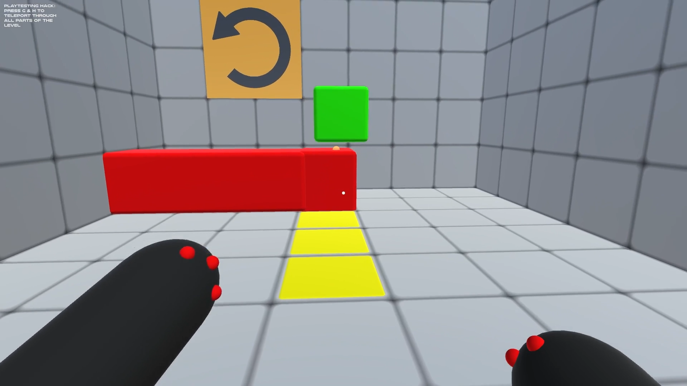

# Reverse Engineering Q.U.B.E.

A technical recreation of the first few levels of the puzzle-platformer video game Q.U.B.E.

I used this project to practice my basic Unity development skills, with a variety of physics-based game mechanics. Made for the course Platform Development 2 at Howest Digital Arts & Entertainment.

